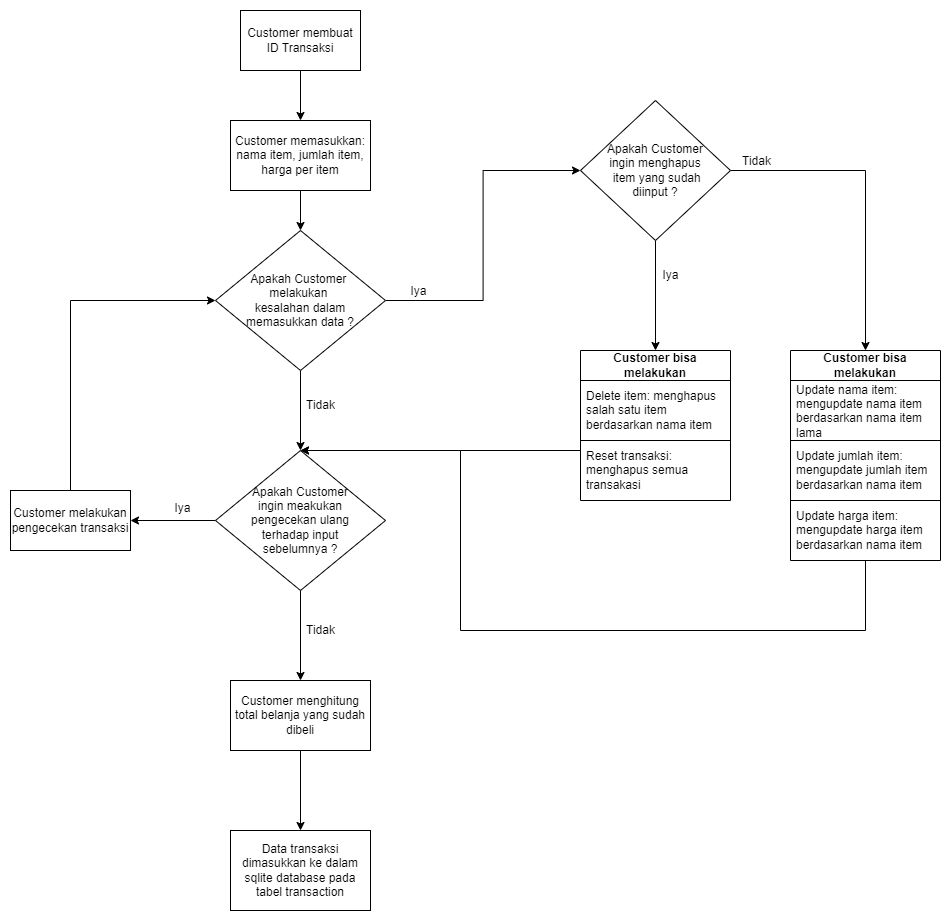
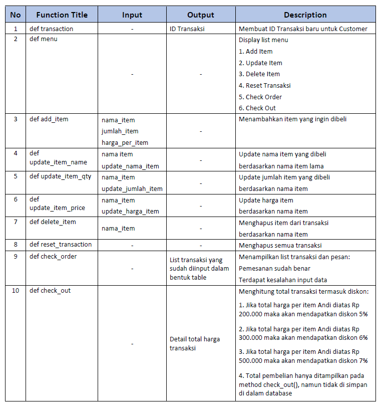

# Python Project: Self-Service Cashier

## 1. Background

Membuat sistem kasir yang self-service di supermarket dengan harapan:
* Customer bisa langsung memasukkan item yang dibeli, jumlah item yang dibeli, dan harga item yang dibeli dan fitur yang lain.
* Customer yang tidak berada di kota tersebut bisa membeli barang dari supermarket tersebut.

## 2. Requirements / Objectives
1. Buat flow diagram berdasarkan requirements
    Program objective:
    * Menambahkan item transaksi
    * Update item transaksi
    * Delete item transaksi
    * Menghitung total transaksi
    * Menambahkan transaksi ke dalam SQLite databse

_Diagram 1: Flow proses diagram untuk Self-Service Cashier_

2. Buat SQLite Database untuk menyimpan data transaksi
    Buat Database dengan nama "db_cashier" berisi 1 table _transaction_, yang berisikan kolom:
    * no_id         : nomor id (auto increment)
    * nama_item     : nama barang yang dibeli
    * jumlah_item   : jumlah barang yang dibeli
    * harga         : harga barang
    * total_harga   : total harga (jumlah item * harga)
    * diskon        : potongan harga yang didapatkan
    * harga_diskon  : harga item setelah diskon
    Output: db_cashier.sql

3. Buat Python Program 
    * Step 1: Import module yang dibutuhkan (tabular, random, sqlite, sqlalchemy)
    * Step 2: Buat koneksi dengan database SQLite
    * Step 3: Buat _function_ berdasarkan _requirements_ yang dibutuhkan
    
    
    _Diagram 2: Table dari list function yang digunakan untuk Self-Service Cashier_

    * Output: main.py file 

## 3. Running
## 4. Test Cases & Results
## 5. Test Case